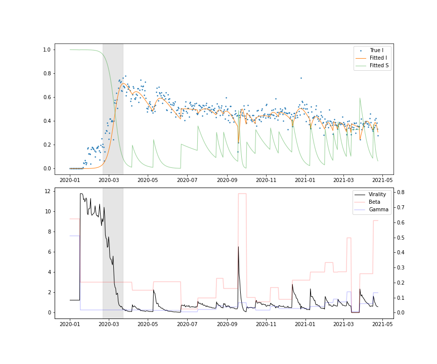
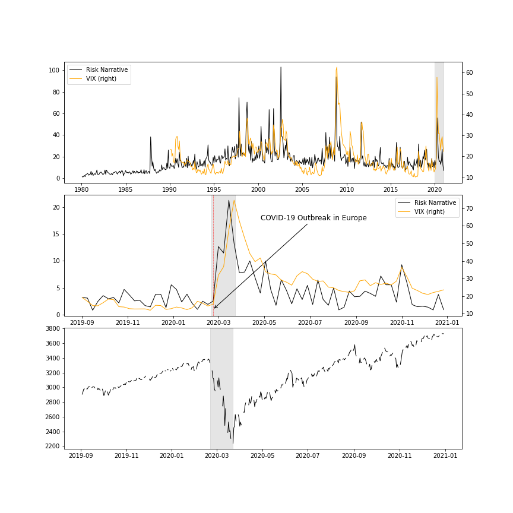

[](http://quantlet.de/)

## [](http://quantlet.de/) **COVID_Risk_Narratives** [](http://quantlet.de/)

```yaml

Name of Quantlet: COVID_Risk_Narratives

Published in: Digital Finance 

Description: The supporting materials for paper "COVID Risk Narratives - A Computational Linguistic Approach to the Econometric Identification of Narrative Risk During a Pandemic". Techniques included - sentiment analysis (bag-of-words method), topic modelling (LDA), word embedding (word2vec), SIR epidemiological model, vector autoregression. Main use of the codes - 1) Identification of important/perennial economic narratives. 2) Monitor narratives of interest for financial forecasting. 

Keywords: narrative economics, COVID-19, natural language processing, tone analysis, early warning indicator

Author: Yuting Chen, University College Dublin

Submitted: 20211105

Input: Raw texts that contain the narratives of interest

Output: Identified narratives and the features that could be used in financial forecasting
```





### [IPYNB Code: COVID_Risk_Narratives.ipynb](COVID_Risk_Narratives.ipynb)


automatically created on 2021-11-07